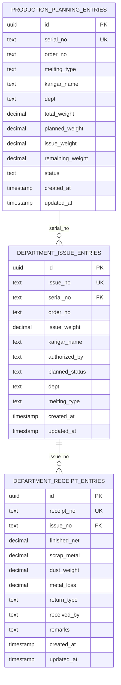

# Department Flow Relationship Plan

This document defines the target database relationship for this flow:

```txt
Production Planning -> Department Issue -> Department Receipt
```

This document started as the review plan and now reflects the implemented relationship target in the schema, API payloads, and frontend receipt submission.

## Current Problem

The current receipt table stores `issue_id`, which points to the UUID primary key of `department_issue_entries`.

```txt
department_receipt_entries.issue_id -> department_issue_entries.id
```

That works technically, but it is not the business flow you want to use in the UI and reports. The department issue screen already generates an `issue_no`, and the department receipt should be created against that `issue_no`.

Also, department issue should be connected to production planning by `serial_no`, because production planning creates the production serial first, then department issue happens for that serial.

## Target Relationship

```txt
production_planning_entries.serial_no
  -> department_issue_entries.serial_no
  -> department_receipt_entries.issue_no
```

More exactly:

```txt
department_issue_entries.serial_no
  references production_planning_entries.serial_no

department_receipt_entries.issue_no
  references department_issue_entries.issue_no
```

## Table Design

### 1. `production_planning_entries`

This is the parent table for production work.

| Column | Type | Key | Purpose |
| --- | --- | --- | --- |
| `id` | uuid | Primary key | Internal database row ID |
| `serial_no` | text | Unique business key | Production serial number shown in app |
| `order_no` | text | Data field | Customer/order reference |
| `dept` | text | Data field | Department planned for the work |
| `planned_weight` | decimal | Data field | Planned department weight |
| `issue_weight` | decimal | Data field | Issued weight summary |
| `remaining_weight` | decimal | Data field | Remaining weight |
| `status` | text | Data field | Planning status |

Required change:

```txt
serial_no must be unique
```

Reason:
`department_issue_entries.serial_no` can only safely reference it if every production serial is unique.

### 2. `department_issue_entries`

This is the child of production planning and parent of department receipts.

| Column | Type | Key | Purpose |
| --- | --- | --- | --- |
| `id` | uuid | Primary key | Internal database row ID |
| `issue_no` | text | Unique business key | Department issue number shown in app |
| `serial_no` | text | Foreign key | Links to `production_planning_entries.serial_no` |
| `order_no` | text | Data field | Copied/displayed from production planning |
| `issue_weight` | decimal | Data field | Weight issued to department |
| `karigar_name` | text | Data field | Worker/karigar |
| `authorized_by` | text | Data field | User who authorized issue |
| `planned_status` | text | Data field | `pending`, `partially_returned`, `completed` |
| `dept` | text | Data field | Department receiving the issue |
| `melting_type` | text | Data field | 22K/20K/18K/etc. |

Required relationship:

```txt
department_issue_entries.serial_no
  -> production_planning_entries.serial_no
```

Existing good part:

```txt
department_issue_entries.issue_no is already unique
```

### 3. `department_receipt_entries`

This is the child of department issue.

| Column | Type | Key | Purpose |
| --- | --- | --- | --- |
| `id` | uuid | Primary key | Internal database row ID |
| `receipt_no` | text | Unique business key | Receipt number generated by backend |
| `issue_no` | text | Foreign key | Links to `department_issue_entries.issue_no` |
| `finished_net` | decimal | Data field | Finished received weight |
| `scrap_metal` | decimal | Data field | Scrap received weight |
| `dust_weight` | decimal | Data field | Dust received weight |
| `metal_loss` | decimal | Data field | Loss weight |
| `return_type` | text | Data field | `PartlyReturn` or `CompleteReturn` |
| `received_by` | text | Data field | User who received |
| `remarks` | text | Data field | Optional notes |

Required change:

```txt
Remove/stop using issue_id for receipt creation.
Use issue_no instead.
```

Target relationship:

```txt
department_receipt_entries.issue_no
  -> department_issue_entries.issue_no
```

## Final ERD

### Mermaid ER Diagram



### Simple Relationship View

```txt
production_planning_entries
---------------------------
id              uuid primary key
serial_no       text unique
order_no        text
dept            text
...

        1
        |
        | serial_no
        |
        many

department_issue_entries
------------------------
id              uuid primary key
issue_no        text unique
serial_no       text foreign key -> production_planning_entries.serial_no
order_no        text
issue_weight    decimal
planned_status  text
dept            text
...

        1
        |
        | issue_no
        |
        many

department_receipt_entries
--------------------------
id              uuid primary key
receipt_no      text unique
issue_no        text foreign key -> department_issue_entries.issue_no
finished_net    decimal
scrap_metal     decimal
dust_weight     decimal
metal_loss      decimal
return_type     text
...
```

## API Payload Changes

### Department Issue Create

Current department issue creation can continue to receive production data, but it should ensure the submitted `serialNo` exists in production planning.

Target payload:

```json
{
  "serialNo": "PP-0001",
  "orderNo": "ORD-001",
  "issueWeight": "10.000",
  "karigarName": "Name",
  "authorizedBy": "Admin",
  "dept": "Die",
  "meltingType": "22K"
}
```

Backend should:

1. Verify `serialNo` exists in `production_planning_entries`.
2. Generate `issueNo`.
3. Save department issue with `serialNo`.
4. Update production planning issue/status fields if required.

### Department Receipt Create

Current frontend sends:

```json
{
  "issueId": "uuid"
}
```

Target frontend should send:

```json
{
  "issueNo": "IS-0001",
  "finishedNet": 8.5,
  "scrapMetal": 1.0,
  "dustWeight": 0.25,
  "metalLoss": 0.25,
  "returnType": "CompleteReturn",
  "receivedBy": "Admin",
  "remarks": ""
}
```

Backend should:

1. Verify `issueNo` exists in `department_issue_entries`.
2. Generate `receiptNo`.
3. Save receipt with `issueNo`.
4. Update department issue `plannedStatus`.
5. If `PartlyReturn`, create the next issue row if that remains part of the business rule.

## Query Shape For History Page

Department receipt history should join through `issue_no`.

```txt
receipt.issue_no -> issue.issue_no -> planning.serial_no
```

Expected history data:

| Field | Source |
| --- | --- |
| Return # | `department_receipt_entries.receipt_no` |
| IS-Number | `department_receipt_entries.issue_no` |
| Serial No | `department_issue_entries.serial_no` |
| Order No | `department_issue_entries.order_no` |
| Department | `department_issue_entries.dept` |
| Finished Net | `department_receipt_entries.finished_net` |
| Scrap | `department_receipt_entries.scrap_metal` |
| Dust Wt | `department_receipt_entries.dust_weight` |
| Metal Loss | `department_receipt_entries.metal_loss` |
| Status | `department_receipt_entries.return_type` |
| Date | `department_receipt_entries.created_at` |

## Migration Plan

Recommended implementation order:

1. Add unique constraint on `production_planning_entries.serial_no`.
2. Add foreign key from `department_issue_entries.serial_no` to `production_planning_entries.serial_no`.
3. Add `issue_no` column to `department_receipt_entries`.
4. Backfill `department_receipt_entries.issue_no` using existing `issue_id`.
5. Add foreign key from `department_receipt_entries.issue_no` to `department_issue_entries.issue_no`.
6. Update backend receipt validation to require `issueNo` instead of `issueId`.
7. Update backend receipt service to find/update issue by `issueNo`.
8. Update frontend Department Receipt submit payload to send `issueNo`.
9. Update receipt history query/mapping to use `issueNo`.
10. After verifying existing data, remove or stop using `issue_id`.

## Important Decision Before Implementation

There are two possible final designs:

### Option A: Business-key foreign keys only

Use:

```txt
department_issue_entries.serial_no -> production_planning_entries.serial_no
department_receipt_entries.issue_no -> department_issue_entries.issue_no
```

This matches your request and makes the data easy to read.

### Option B: Keep UUID foreign keys plus business columns

Use:

```txt
department_issue_entries.production_planning_id -> production_planning_entries.id
department_receipt_entries.issue_id -> department_issue_entries.id
```

Also store:

```txt
serial_no
issue_no
```

This is stronger for database integrity, but the app can still display and submit business numbers.

## Recommended Choice

For your requested workflow, use Option A now:

```txt
Production Planning serial_no
  -> Department Issue serial_no
  -> Department Receipt issue_no
```

This keeps the app flow clear:

1. Production planning creates `serial_no`.
2. Department issue uses that `serial_no` and creates `issue_no`.
3. Department receipt uses that `issue_no`.
